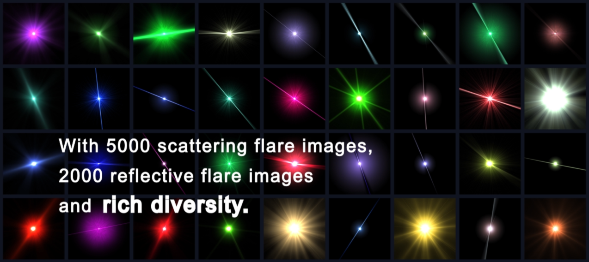

# Flare7K++: Mixing Synthetic and Real Datasets for Nighttime Flare Removal and Beyond

[Project Page](https://ykdai.github.io/) | [Video](https://youtu.be/CR3VFj4NOQM)



This repository provides the official implementation for the following two papers:

<p>
<div><strong>Flare7K: A Phenomenological Nighttime Flare Removal Dataset</strong></div>
<div><a href="https://ykdai.github.io/">Yuekun Dai</a>, 
   	<a href="https://li-chongyi.github.io/">Chongyi Li</a>,
    <a href="https://shangchenzhou.com/">Shangchen Zhou</a>,
    <a href="https://jnjaby.github.io/">Ruicheng Feng</a>, 
    <a href="https://www.mmlab-ntu.com/person/ccloy/">Chen Change Loy</a></div>
<div>Accepted to <strong>NeurIPS 2022</strong></div><div><a href="https://arxiv.org/abs/2210.06570"> arXiv </a>
</p>

<p>
<div><strong>Flare7K++: Mixing Synthetic and Real Datasets for Nighttime Flare Removal and Beyond</strong></div>
<div><a href="https://ykdai.github.io/">Yuekun Dai</a>, 
   	<a href="https://li-chongyi.github.io/">Chongyi Li</a>,
    <a href="https://shangchenzhou.com/">Shangchen Zhou</a>,
    <a href="https://jnjaby.github.io/">Ruicheng Feng</a>,
    <a href="https://github.com/Luo-Yihang/">Yihang Luo</a>,
    <a href="https://www.mmlab-ntu.com/person/ccloy/">Chen Change Loy</a></div>
<div>arXiv Preprint, 2023</div>
<div><a href="https://arxiv.org/abs/2306.04236"> arXiv </a>
</p>

### Flare7K++
**Flare7K++**, the first comprehensive nighttime flare removal dataset, consists of 962 real-captured flare images (**Flare-R**) and 7,000 synthetic flares (**Flare7K**). **Flare7K** is generated based on the observation and statistic of real-world nighttime lens flares. It offers 5,000 scattering flare images and 2,000 reflective flare images, consisting of 25 types of scattering flares and 10 types of reflective flares. **Flare-R** is captured by smartphone rear cameras with different lens contaminants in the dark room. These flare patterns can be randomly added to the flare-free images, forming the flare-corrupted and flare-free image pairs.

### Update

- **2022.06.09**: We will release the checkpoint and training code for our Flare7K++. Please stay tuned🤗.
- **2022.06.08**: We create a mixing dataset called **Flare7K++** that augments the synthetic Flare7K dataset with a new real-captured **Flare-R** dataset.
- **2022.02.09**: Our training code is released.
- **2022.12.28**: The [MIPI Workshop 2023](https://mipi-challenge.org/MIPI2023/) is released now. Our dataset serves as a track in this challenge. Please check the [CodaLab](https://codalab.lisn.upsaclay.fr/competitions/9402) page to find more details about our challenge.
- **2022.10.12**: Upload a flare-corrupted test dataset without ground truth.
- **2022.10.11**: Upload the dataset and pretrained model in Baidu Netdisk.
- **2022.10.09**: Update baseline inference code for flare removal.
- **2022.09.16**: Our paper *Flare7K: A Phenomenological Nighttime Flare Removal Dataset* is accepted by the NeurIPS 2022 Track Datasets and Benchmarks. 🤗
- **2022.08.27**: Update dataloader for our dataset.
- **2022.08.25**: Increase the number of test images from 20 to 100. Please download the latest version of our Flare7K dataset.
- **2022.08.19**: This repo is created.

### Data Download

|     | Baidu Netdisk | Google Drive | Number | Description|
| :--- | :--: | :----: | :---- | ---- |
| Flare7K++(**new**) | [link](https://pan.baidu.com/s/1wdK6b7aVazfoJbUo18qfgw?pwd=nips ) | [link](https://drive.google.com/file/d/1PPXWxn7gYvqwHX301SuWmjI7IUUtqxab/view) | 7,962 | Flare7K++ consists of Flare7K and Flare-R. Flare7K offers 5,000 scattering flare images and 2,000 reflective flare images, consisting of 25 types of scattering flares and 10 types of reflective flares. Flare-R offers 962 real-captured flare patterns. |
| Background Images| [link](https://pan.baidu.com/s/1BYPRCNSsVmn4VvuU4y4C-Q?pwd=zoyv) | [link](https://drive.google.com/file/d/1GNFGWfUbgXfELx5fZtjTjU2qqWnEa-Lr/view) | 23,949 | The background images are sampled from [[Single Image Reflection Removal with Perceptual Losses, Zhang et al., CVPR 2018]](https://people.eecs.berkeley.edu/~cecilia77/project-pages/reflection.html). We filter our most of the flare-corrupted images and overexposed images.|
| Flare-corrupted images | [link](https://pan.baidu.com/s/1bCOOpO3FKBZvI1aezfbFOw?pwd=ears) | [link](https://drive.google.com/file/d/19kLXf8roHoJmxyphYvrCs9zDAXsrL1sU/view?usp=sharing) | 645 | We offer an extra flare-corrupted dataset without ground truth. It contains 645 images captured by different cameras and some images are very challenging. |

### Paired Data Generation

We provide a on-the-fly dataloader function and a flare-corrupted/flare-free pairs generation script in this repository. To use this function, please put the Flare7K dataset and 24K Flickr dataset on the same path with the `generate_flare.ipynb` file.

If you only want to generate the flare-corrupted image without reflective flare, you can comment out the following line:
```
# flare_image_loader.load_reflective_flare('Flare7K','Flare7k/Reflective_Flare')
```


### Pretrained Model

The inference code based on Uformer is released Now. Your can download the pretrained checkpoints on [[GoogleDrive](https://drive.google.com/file/d/1uFzIBNxfq-82GTBQZ_5EE9jgDh79HVLy/view?usp=sharing) | [Baidu Netdisk](https://pan.baidu.com/s/1EJSYIbbQe5SZYiNIcvrmNQ?pwd=xui4 )]. Please place it under the `experiments` folder and unzip it, then you can run the `deflare.ipynb` for inference. We provide two models, the model in the folder `uformer` can help remove both the reflective flares and scattering flares. The `uformer_noreflection` one can only help remove the scattering flares but is more robust. 

| Training Data       |                        Baidu Netdisk                         |                         Google Drive                         |
| :------------------ | :----------------------------------------------------------: | :----------------------------------------------------------: |
| Flare7K             | [link](https://pan.baidu.com/s/1fiuOcygs0bfhWBvYndkVtw?pwd=x420) | [link](https://drive.google.com/file/d/1PPXWxn7gYvqwHX301SuWmjI7IUUtqxab/view) |
| Flare7K++ (**new**) |                         Coming soon                          |                         Coming soon                          |

### Evaluation Code
To calculate different metrics with our pretrained model, you can run the `evaluate.py` by using:
```
python evaluate.py --input result/blend/ --gt dataset/Flare7k/test_data/real/gt/
```

### Training model

**Training with single GPU**

To train a model with your own data/model, you can edit the `options/uformer_flare7k_option.yml` and run the following codes. You can also add `--debug` command to start the debug mode:

```
python basicsr/train.py -opt options/uformer_flare7k_option.yml
```

**Training with multiple GPU**

You can run the following command for the multiple GPU tranining:

```
CUDA_VISIBLE_DEVICES=0,1 bash scripts/dist_train.sh 2 options/uformer_flare7k_option.yml
```

### Flare7k++ structure

```
├── Flare7K
    ├── Reflective_Flare 
    ├── Scattering_Flare
         ├── Compound_Flare
         ├── Glare_with_shimmer
         ├── Core
         ├── Light_Source
         ├── Streak
├── Flare-R
	├── Compound_Flare
	├── Light_Source
├── test_data
     ├── real
          ├── input
          ├── gt
          ├── mask
     ├── synthetic
          ├── input
          ├── gt

```

In our Flare7K++ dataset, we also update light source annotations for Flare7K dataset, new version contains a tiny glare around the light source to increase the reality. If you want to use the old version, please use the core annotations.

### License

This project is licensed under <a rel="license" href="https://github.com/ykdai/Flare7K/blob/main/LICENSE">S-Lab License 1.0</a>. Redistribution and use of the dataset and code for non-commercial purposes should follow this license.

### Citation

If you find this work useful, please cite:

```
@inproceedings{dai2022flare7k,
  title={Flare7K: A Phenomenological Nighttime Flare Removal Dataset},
  author={Dai, Yuekun and Li, Chongyi and Zhou, Shangchen and Feng, Ruicheng and Loy, Chen Change},
  booktitle={Thirty-sixth Conference on Neural Information Processing Systems Datasets and Benchmarks Track},
  year={2022}
}

@inproceedings{dai2023nighttime,
  title={Nighttime Smartphone Reflective Flare Removal using Optical Center Symmetry Prior},
  author={Dai, Yuekun and Luo, Yihang and Zhou, Shangchen and Li, Chongyi and Loy, Chen Change},
  booktitle = {Proceedings of the IEEE Conference on Computer Vision and Pattern Recognition (CVPR)},
  year = {2023}
}

@article{dai2023flare7kpp,
      title={Flare7K++: Mixing Synthetic and Real Datasets for Nighttime Flare Removal and Beyond}, 
      author={Yuekun Dai and Chongyi Li and Shangchen Zhou and Ruicheng Feng and Yihang Luo and Chen Change Loy},
      year={2023}
}

```

### Contact
If you have any question, please feel free to reach me out at `ydai005@e.ntu.edu.sg`.
